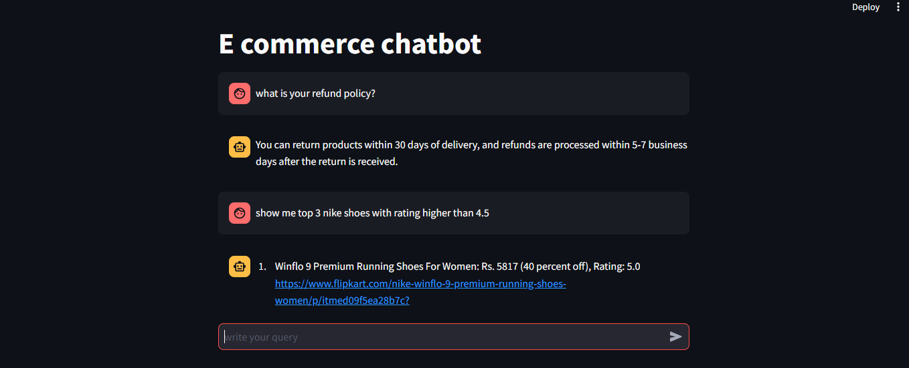
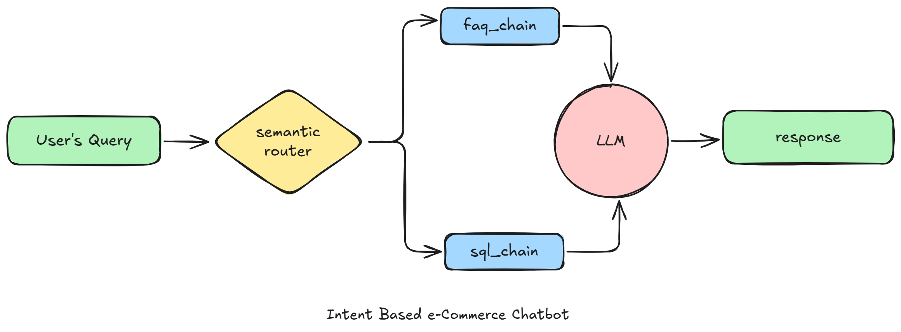

Perfect — here’s your **personalized README.md** rewritten completely for your version of the project, credited to **Mahima Reddy Kota**, while keeping it clean, professional, and GitHub-ready 👇

---

````markdown
# 💬 E-commerce Chatbot (Gen AI RAG Project using LLama3.3 and GROQ)

This is a **Proof of Concept (POC)** for an intelligent AI-powered chatbot tailored for an **e-commerce platform**, designed and implemented by **Mahima Reddy Kota**.  
It enables seamless, natural, and intelligent user interactions by accurately identifying the intent behind queries and generating relevant responses — either from an FAQ knowledge base or a live database.

The chatbot integrates **LLama 3.3 (via GROQ API)**, **RAG (Retrieval-Augmented Generation)**, and **real-time SQL querying**, combining them into a single Streamlit-based conversational interface.

---

## 🧠 Project Overview

The chatbot currently supports two key intents:

- **FAQ Route:**  
  Triggered when users ask general or platform-related questions.  
  _Example:_ “What is your return policy?”  

- **SQL Route:**  
  Triggered when users ask for product data or filtered listings.  
  _Example:_ “Show me all Nike shoes below ₹3000 with ratings above 4.5.”  

By intelligently routing queries between these two modes, the chatbot delivers both **informational** and **data-driven** answers.

---

## 🗂️ Folder Structure

```plaintext
project-ecommerce-tool/
│
├── app/
│   ├── main.py              # Streamlit interface
│   ├── faq.py               # RAG logic for FAQs
│   ├── sql.py               # SQL generation and execution pipeline
│   ├── router.py            # Intent classifier
│   ├── resources/
│   │   ├── faq_data.csv     # FAQ dataset
│   │   ├── product-ss.png   # Product output screenshot
│   │   └── architecture-diagram.png
│   └── .env                 # Contains GROQ credentials
│
├── db.sqlite                # Product database
├── web-scraping/            # Scripts for product data scraping
└── README.md
````

---

## 🧩 Architecture

The system is divided into three core layers:

1. **Routing Layer:**
   Determines whether a query is FAQ or SQL-based.
2. **FAQ (RAG) Layer:**
   Uses ChromaDB and SentenceTransformer embeddings to fetch the best possible answer from a local FAQ dataset.
3. **SQL Layer:**
   Uses Llama 3.3 via Groq API to convert user queries into SQL, executes them on SQLite, and converts the result into a natural language response.

---

## 🛠️ Setup & Execution

### 1️⃣ Install all dependencies

```bash
pip install -r app/requirements.txt
```

### 2️⃣ Create a `.env` file inside the `app/` folder with your GROQ credentials

```text
GROQ_MODEL=llama-3.3-70b-versatile
GROQ_API_KEY=<your_groq_api_key_here>
```

### 3️⃣ Run the Streamlit app

From the project root directory, execute:

```bash
streamlit run app/main.py
```

---

## 🧠 Example Queries

| Type | Example Query                                     |
| ---- | ------------------------------------------------- |
| FAQ  | What payment methods do you accept?               |
| FAQ  | How can I return a damaged product?               |
| SQL  | Show top 3 Nike shoes with rating higher than 4.5 |
| SQL  | List all Puma sneakers below ₹2500                |

---

## 💻 Tech Stack

| Component                  | Technology                               |
| -------------------------- | ---------------------------------------- |
| **Frontend**               | Streamlit                                |
| **Backend**                | Python                                   |
| **LLM API**                | GROQ (LLama 3.3)                         |
| **Database**               | SQLite                                   |
| **Vector Store**           | ChromaDB                                 |
| **Embeddings**             | Sentence Transformers (all-MiniLM-L6-v2) |
| **Environment Management** | python-dotenv                            |

---

## 📸 Screenshots

**Product Example Output:**


**Architecture Diagram:**


---

## 🚀 Future Improvements

* Add support for **order tracking** and **personalized recommendations**.
* Integrate with live **e-commerce APIs** for real-time product updates.
* Expand RAG data sources to include customer support documentation.
* Deploy using **FastAPI backend** or **Docker container**.

---

## 👩‍💻 Author

**Mahima Reddy Kota**
Developer & AI Enthusiast passionate about Generative AI, Data Science, and conversational systems.
Exploring real-world AI applications in e-commerce automation and customer experience.

---

### 🧾 License

MIT License © 2025 Mahima Reddy Kota
Attribution is required for reuse.
Commercial use without written permission is strictly prohibited.

---

```


```
